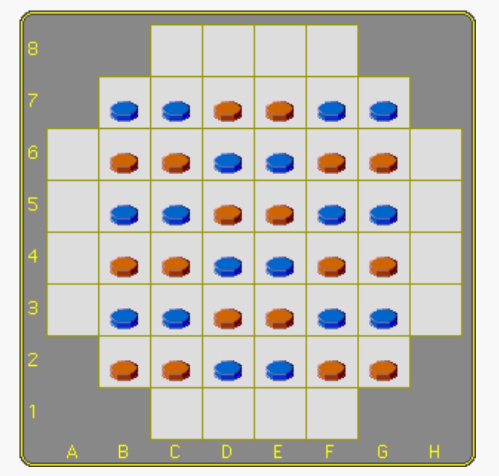
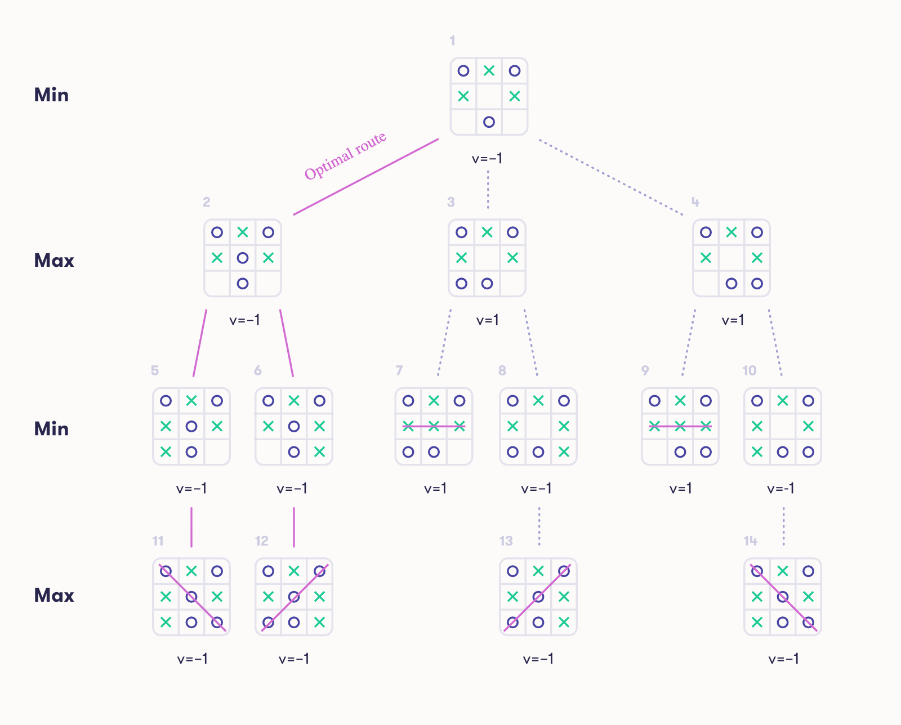

# 1. Introduction


Focus is a game played on a square board with some of the corners removed.

It is an abstract strategy game in which players attempt to make moves and capture pieces in such a manner that their opponent(s) have no moves remaining



### Rules
Each player has 18 pieces called **man**, and they can stack on each other creating **stacks of men**


- Players move, and must move, in turn. Blue moves first
- A stack is owned by the player whose color is on top.
- On his turn a player moves a man or a stack of men horizontally or vertically, based on the number of pieces to be moved 
  - Stacks may be split in this process
- When a stack grows over five pieces tall, the remaining men are removed from the bottom of the stack
  - Men of a player's own color become 'reserves' to be re-entered into the game at a later time
  - Pieces of the opponent's color are captured
- Instead of moving a piece, a player may choose to enter one of his reserves on any square of the board, whether vacant, or occupied by a piece of either color


### Objectives

A player wins when his opponent cannot move a piece, nor enter a reserve on the board


# 2. Related Work

### [Elements of AI Course (AI problem solving)](https://course.elementsofai.com/2)



# 3. Problem Formulation

### State Representation

- **Board Configuration**: This is implemented as a 2D list, where each element corresponds to a cell on an 8x8 grid. Each cell contains a list (or stack) of integers, with each integer representing a piece owned by a player. Player 1's pieces are denoted by `1`, and Player 2's pieces by `2`. The corners of the board, which are not used in the game, can be represented by `None` or an empty list to indicate that the cell is non-playable.

```python
board = [
    
  [None, None, [], [], [], [], None, None],
    
  [None, [1], [2], [2], [1], [1], [2], None],
  ...
  [None, None, [], [], [], [], None, None]
]
```

- **Stacks of Pieces**: Within each cell's list, pieces can stack on top of each other. A stack's ownership is determined by the last element in the list (e.g., if the last element is `1`, Player 1 owns the stack).

- **Reserved Pieces**: These can be tracked with two variables, one for each player, to keep count of pieces that have been captured but can be re-entered onto the board. (NIP)

- **Captured Pieces**: Similar to reserved pieces, captured pieces can also be tracked with variables, reflecting the number of opponent's pieces each player has permanently removed from the game. (NIP)

### Initial State
The initial board setup is defined in the `initialize_board` function, creating the starting layout of pieces for both players in a symmetrical pattern.


### Objective Test
A player wins when their opponent cannot move any piece or enter any reserved piece onto the board. This condition is checked after each move to determine if the game has ended

### Operators (Moves)
1. **Move Stack**: The move operation involves selecting a stack (or a single piece), determining a valid destination based on the stack size, and moving the pieces accordingly.

### Terminal Test
The terminal condition is evaluated by checking if a player has any legal moves available. This involves scanning the board for any possible moves a player can make with their stacks or reserved pieces. If no moves are available, the game ends.

### Heuristic Evaluation

`evaluate_state`: Heuristically evaluates the desirability of a game state from the perspective of a given player. The evaluation favors game states where the player controls more stacks and especially values larger stacks.

#### Maximizing
> For the maximizing player (the AI or the player whose turn it is to move), the score increases with the control and size of the stacks.
> 
> `score += 5 * len(stack)`

#### Minimizing

> For the minimizing player (the opponent), its considered the stacks controlled by the opponent and diminishes the score based on their size. 
> 
>`score -= 3 * len(stack)`


# 4. Implementation Work

The project is being developed using Python and the [pygame](https://www.pygame.org/docs/) library for the GUI

